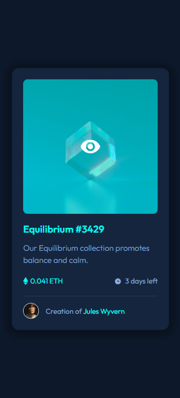
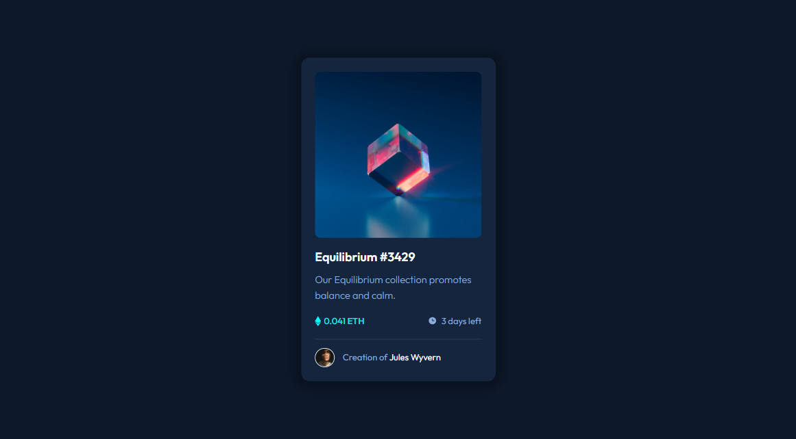
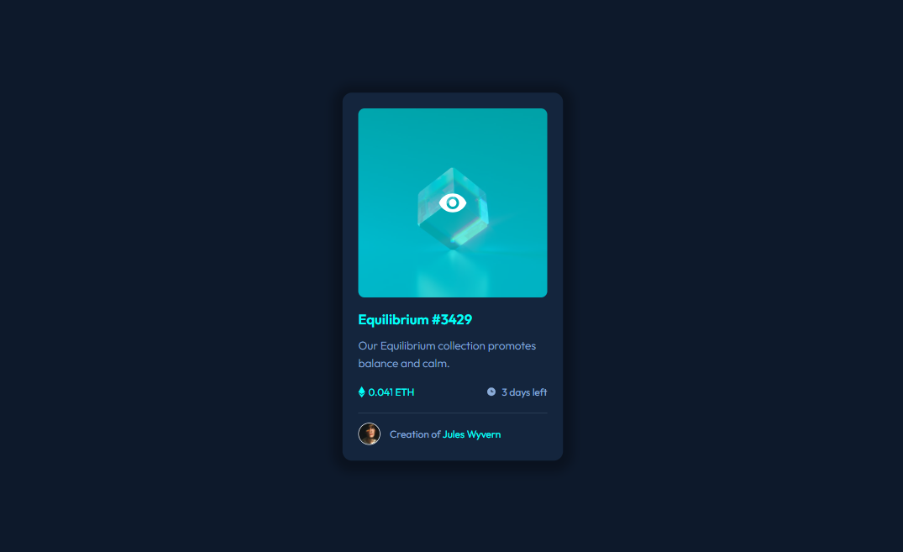

# Frontend Mentor - NFT preview card component solution

This is a solution to the [NFT preview card component challenge on Frontend Mentor](https://www.frontendmentor.io/challenges/nft-preview-card-component-SbdUL_w0U). Frontend Mentor challenges help you improve your coding skills by building realistic projects. 

## Table of contents

- [Overview](#overview)
  - [The challenge](#the-challenge)
  - [Screenshot](#screenshot)
  - [Links](#links)
- [My process](#my-process)
  - [Built with](#built-with)
  - [What I learned](#what-i-learned)
- [Author](#author)
- [Acknowledgments](#acknowledgments)

# Overview

### The challenge

Users should be able to:

- View the optimal layout depending on their device's screen size
- See hover states for interactive elements

## Screenshot

These are screenshots of the project in the initial state and the active state, where all the hovers are activated.

### Mobile Preview



### Desktop Preview




### Links
- Solution URL: [Check my solution on Frontend mentor here !](https://www.frontendmentor.io/solutions/nft-card-preview-using-css-flexbox-Y9Ynho9lI8)
- Live Site URL: [Take a look at the site running here !](https://guisalva.github.io/frontendMentor-nft-card/)

# My process

### Built with

- Semantic HTML5 markup
- CSS custom properties
- CSS Flexbox
- [Google Fonts](https://fonts.google.com/)

### What I learned

With this project I've tested the most of my knowledge in HTML and CSS, in eye sight it is a simple project but when we start coding the dificulties appears, but I am happy with the result, I've learned a lot of new CSS things, and I have a lot more to learn.

This is one of the CSS property that I've learning during the project that I'm most proud :
```css
.nft-card .image-link::before {
}
```
The uses of the pseudo-classes "before" and "after" are calling my attention rsrs.

# Author

- GitHub - [GuiSalva](https://github.com/GuiSalva)
- Frontend Mentor - [@GuiSalva](https://www.frontendmentor.io/profile/GuiSalva)
- LinkedIn - [Guilherme Salvador](https://www.linkedin.com/in/oguilherme-salvador)

# Acknowledgments

I want to greet and thank a lot the twins [Beto](https://github.com/roberto-hofstetter) and [Cadu](https://github.com/cadudias) for the workshop made to develop this project, the pair programming was amazing to get some tips and tricks in Web Development, thank you guys !
